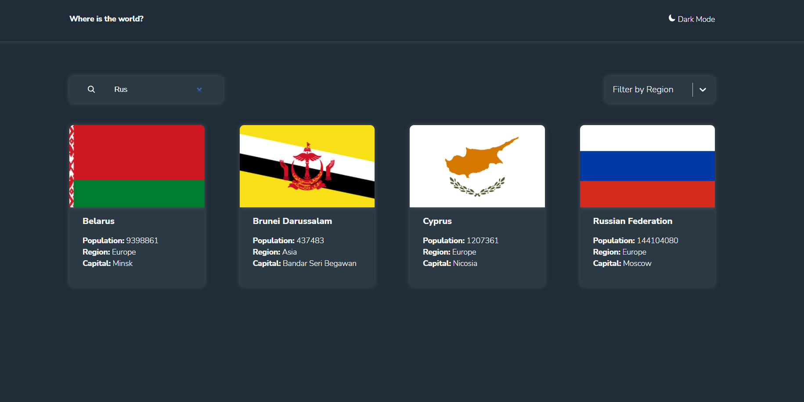

## React Country # [demo](https://vansalivan.github.io/React_country/)

Тренировочный проект по технологии React, styled components работы с API и созданию темной и светлой темы приложения.

Технологии: `React / styled components / react-router-dom / react-select`

### Функционал

1. Отображение данных с реального API
2. Темная/светлая тема
3. Поиск Стран
4. Фильтрация по континентам
5. Детальная страница каждой страны с возможностью навигации по соседним странам
6. Скелетоны в процессе загрузки данных
